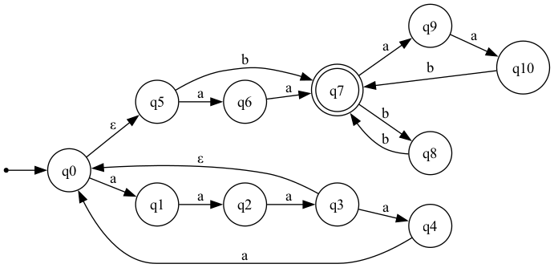
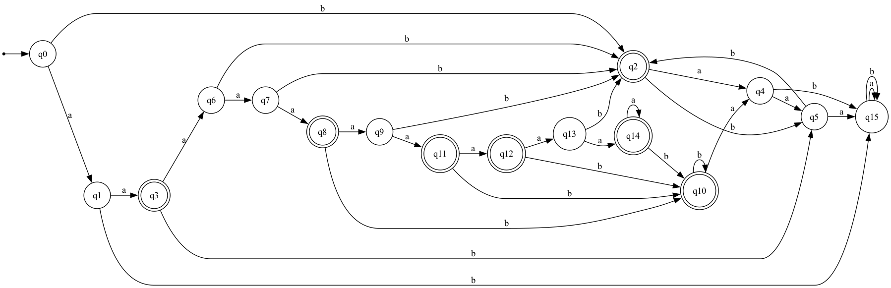
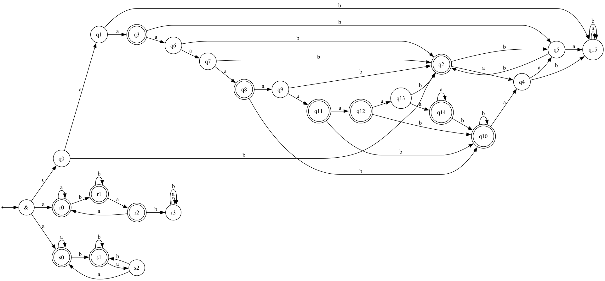

## Изначальное регулярное выражение
```
(aaaaa|aaa)*(aa|b)(bb|aab)*
```

---

## НКА
Файл НКА: dot/nka.dot:



Таблица:
|        | aa | a | aaa | ε | b | ab |
|--------|:--:|:-:|:---:|:-:|:-:|:--:|
| ε      | 1  | 0 |  0  | 0 | 1 | 0  |
| a      | 0  | 1 |  0  | 0 | 0 | 0  |
| aa     | 0  | 0 |  1  | 1 | 0 | 1  |
| b      | 0  | 0 |  0  | 1 | 0 | 0  |
| bb     | 0  | 0 |  0  | 0 | 1 | 0  |
| ba     | 0  | 0 |  0  | 0 | 0 | 1  |

---

## ДКА
Файл ДКА: dot/dka.dot:



Таблица:
|                | ε | a | b | aa | ab | ba | bb | aaa | aab | aba | abb | baa | bab | bba | bbb | aaaa |
| -------------- | :-: | :-: | :-: | :-: | :-: | :-: | :-: | :-: | :-: | :-: | :-: | :-: | :-: | :-: | :-: | :-: |
| ε              | 0 | 0 | 1 | 1 | 0 | 0 | 0 | 0 | 0 | 0 | 0 | 0 | 0 | 0 | 1 | 0 |
| a              | 0 | 1 | 0 | 0 | 0 | 0 | 0 | 0 | 1 | 0 | 1 | 0 | 0 | 0 | 0 | 1 |
| b              | 1 | 0 | 0 | 0 | 0 | 0 | 1 | 0 | 1 | 0 | 0 | 0 | 0 | 0 | 0 | 0 |
| aa             | 1 | 0 | 0 | 0 | 1 | 0 | 1 | 1 | 1 | 0 | 0 | 0 | 0 | 0 | 0 | 0 |
| ba             | 0 | 0 | 0 | 0 | 1 | 0 | 0 | 0 | 0 | 0 | 0 | 0 | 0 | 0 | 0 | 0 |
| bb             | 0 | 0 | 1 | 0 | 0 | 0 | 0 | 0 | 0 | 0 | 0 | 0 | 0 | 0 | 1 | 0 |
| aaa            | 0 | 0 | 1 | 1 | 1 | 0 | 0 | 0 | 1 | 0 | 0 | 0 | 0 | 0 | 1 | 1 |
| aaaa           | 0 | 1 | 1 | 0 | 1 | 0 | 0 | 1 | 1 | 0 | 1 | 0 | 0 | 0 | 1 | 1 |
| aaaaa          | 1 | 0 | 1 | 1 | 1 | 0 | 1 | 1 | 1 | 0 | 0 | 0 | 0 | 0 | 1 | 0 |
| aaaaaa         | 0 | 1 | 1 | 1 | 1 | 0 | 0 | 0 | 1 | 0 | 1 | 0 | 0 | 0 | 1 | 1 |
| aaaaab         | 1 | 0 | 1 | 0 | 0 | 0 | 1 | 0 | 1 | 0 | 0 | 0 | 0 | 0 | 1 | 0 |
| aaaaaaa        | 1 | 1 | 1 | 0 | 1 | 0 | 1 | 1 | 1 | 0 | 1 | 0 | 0 | 0 | 1 | 1 |
| aaaaaaaa       | 1 | 0 | 1 | 1 | 1 | 0 | 1 | 1 | 1 | 0 | 0 | 0 | 0 | 0 | 1 | 1 |
| aaaaaaaaa      | 0 | 1 | 1 | 1 | 1 | 0 | 0 | 1 | 1 | 0 | 1 | 0 | 0 | 0 | 1 | 1 |
| aaaaaaaaaa     | 1 | 1 | 1 | 1 | 1 | 0 | 1 | 1 | 1 | 0 | 1 | 0 | 0 | 0 | 1 | 1 |
| ab             | 0 | 0 | 0 | 0 | 0 | 0 | 0 | 0 | 0 | 0 | 0 | 0 | 0 | 0 | 0 | 0 |


## ПКА
Любое слово из нашего языка не содержит подслова `bab` и не оканчивается на `ba`, поэтому я взял минимальный ДКА и два маленьких автомата, проверяющих эти свойства, и соединил их через одно универсальное состояние `&`.

Из `&` выходят ε-переходы в каждый из трёх автоматов, и слово принимается ПКА только если все три его принимают, поэтому язык ПКА совпадает с исходным языком

Файл ПКА: dot/pka.dot:


---

## Расширенная регулярка
```
^(?=[ab]*$)(?:aaa(?:aa)?)*(?:aa|b)(?:(?:bb|aab)+)?$
```

---

Фазз-тестирование находится в папке fazzing